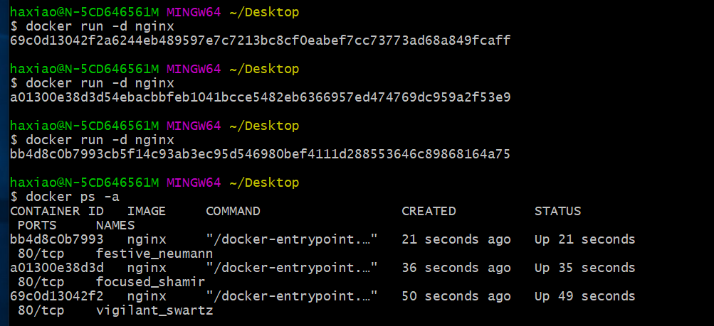
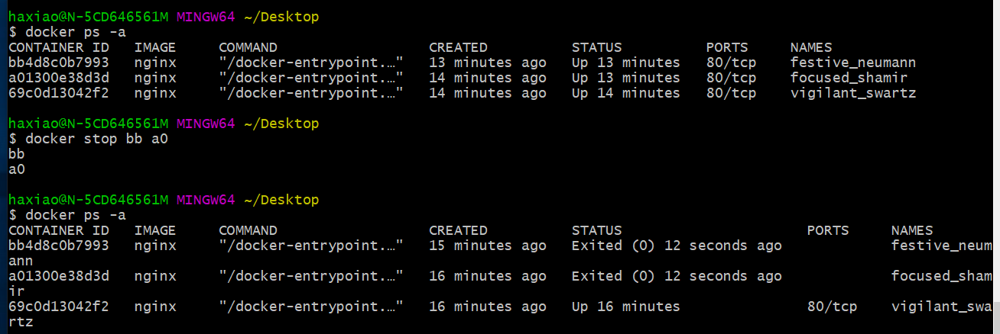
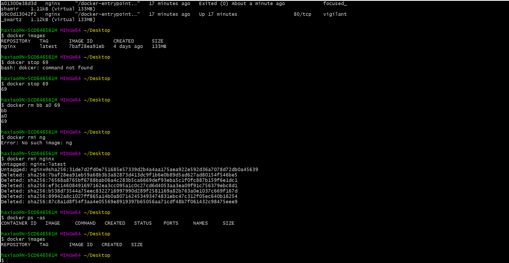
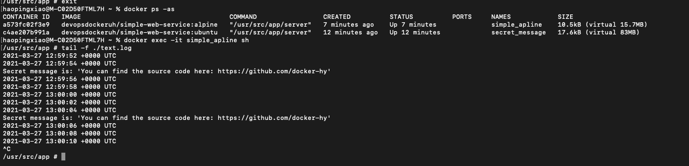

# Part 1

## 1.1 Getting started





## 1.2: Cleanup



## 1.3 Secret message

```bash
docker run --rm --name secret_message -d devopsdockeruh/simple-web-service:ubuntu
docker exec -it secret_message bash
tail -f ./text.log
```

Secret message is: 'You can find the source code here: https://github.com/docker-hy'

## 1.4 Missing dependencies

command:

```bash
docker run -it --rm ubuntu:16.04 sh -c 'apt-get update && apt-get install -y curl; echo "Input website:"; read website; echo "Searching.."; sleep 1; curl http://$website;'
```

## 1.5 Sizes of images



## 1.6 Hello Docker Hub

```bash
docker run -it devopsdockeruh/pull_exercise
Give me the password: basics
You found the correct password. Secret message is:
"This is the secret message"
```

## 1.7 Two line Dockerfile

Commands:

```bash
docker build . -t web-server
docker run --rm web-server
```

## 1.8 Image for script

```bash
docker build -t curler .
docker run --rm -it curler
```

## 1.9 Volumes

```bash
touch text.log
docker run -v $(pwd)/text.log:/usr/src/app/text.log -d --rm devopsdockeruh/simple-web-service
cat text.log
```

## 1.10 Ports open

```bash
docker run --rm -p 3000:8080 web-server
```

## 1.11 Spring

```bash
docker build -t spring .
docker run --rm -d -p 80:8080 spring
```

## 1.12 Hello, frontend!

```bash
docker build -t frontend .
docker run --rm -p 5000:5000 frontend
```

## 1.13 Hello, backend!

```bash
docker build -t backend .
docker run --rm -p 8080:8080 backend
```

## 1.14 Environment

```bash
docker run --rm -p 5000:5000 frontend
docker run --rm -p 8080:8080 backend
```

## 1.15 Homework

https://hub.docker.com/repository/docker/haopingxiao/exercise15

## 1.16 Heroku

https://secret-caverns-03072.herokuapp.com/